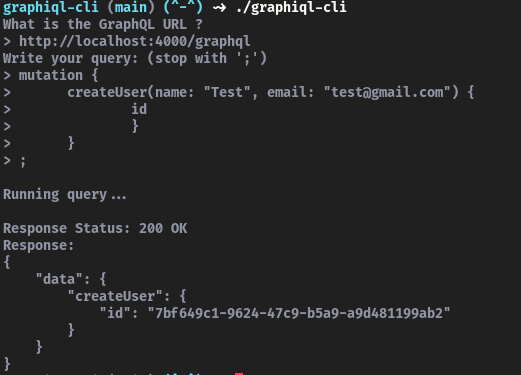
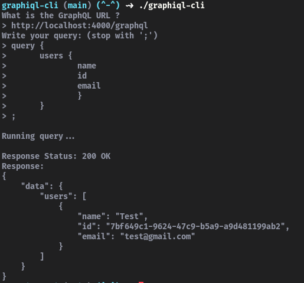

<h1 align="center">graphiql-cli</h1>
<p align="center">A simple CLI to run your GraphQL queries in the terminal!</p>

<br/>

### Why ?

The idea came up one day as i was trying to use [cURL](https://en.wikipedia.org/wiki/CURL) to run my graphql queries but it was too difficult and annoying.
<br/>
So i just made this CLI =D


### Installation

After download, just run:
```
go build
```
And run the program:
```
./graphiql-cli
```


### Examples:

<div align="center">
</img>
<br/>
<br/>
</img>
</div>
